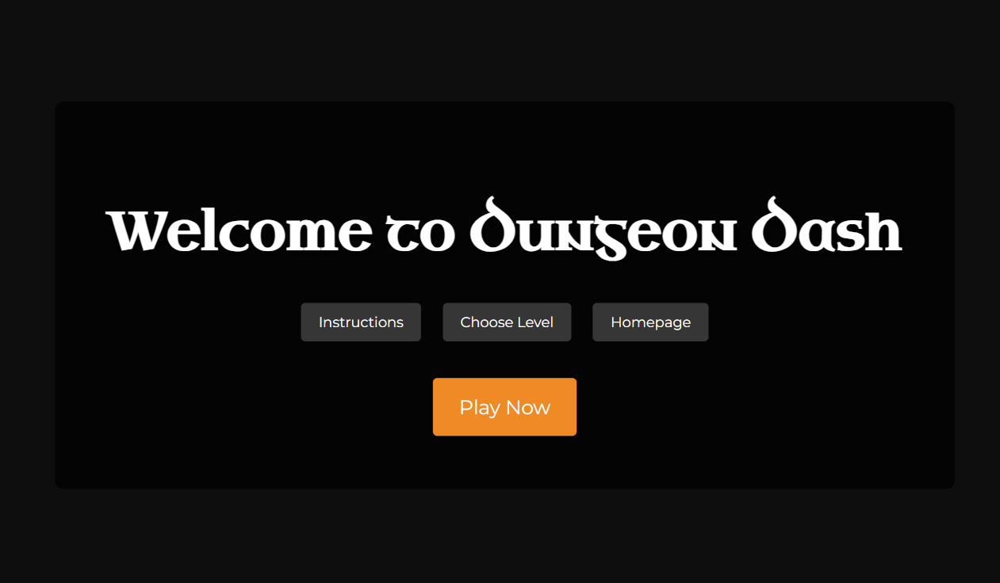
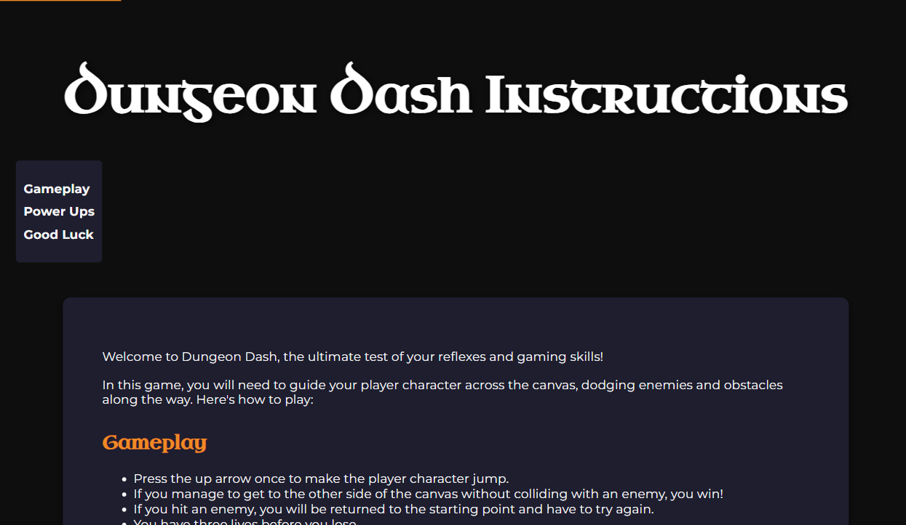
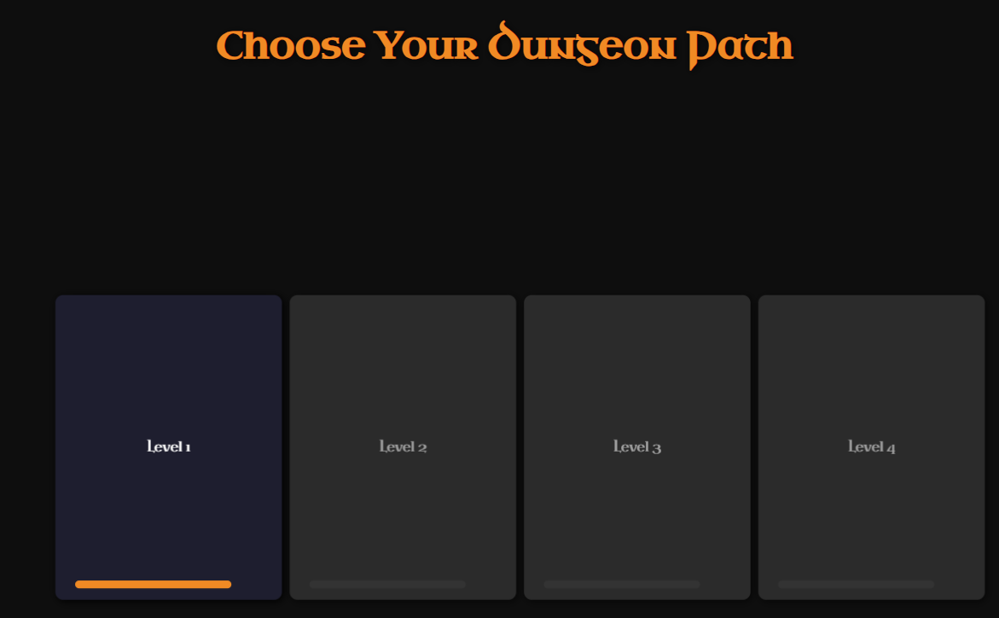
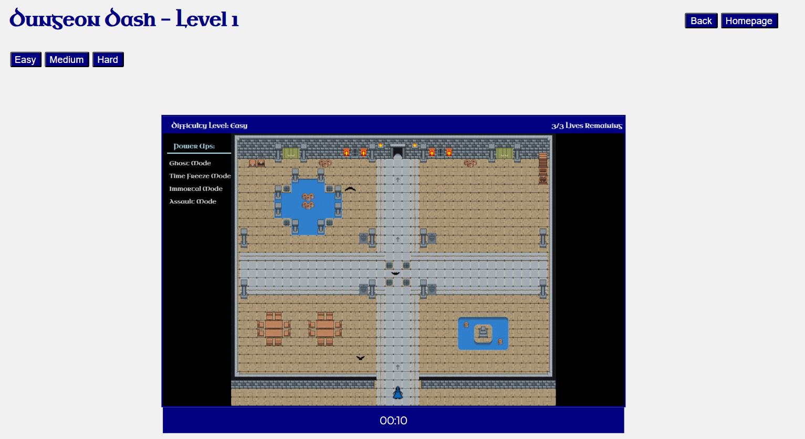

# Dungeon Dash

Dungeon Dash is a 2D client-side game that challenges players' reflexes and strategy. Navigate through various levels, dodge enemies, and utilize unique power-ups to achieve victory.

## Features

- **Interactive Gameplay**: Explore four levels with progressively challenging enemies and obstacles.
- **Multiple Difficulty Modes**: Each level offers Easy, Medium, and Hard modes to suit your skill level.
- **Power-ups**: Enhance gameplay with special abilities:
  - **Ghost Mode**: Avoid all collisions.
  - **Time Freeze Mode**: Halt enemy movements temporarily.
  - **Immortal Mode**: Gain unlimited lives.
  - **Assault Mode**: Attack enemies with a weapon.
- **Leaderboard**: Compete for the fastest completion time across levels.

## Screenshots

### Homepage


### Instructions


### Level Selection


### Gameplay


## File Structure

```plaintext
.
├── images/                # Image assets used in the game
├── background.png         # Game background
├── bat.png                # Enemy sprite
├── bullet.png             # Bullet sprite for Assault Mode
├── favicon.ico            # Game icon
├── game.css               # Global styles for the game
├── homepage.css           # Homepage styles
├── index.html             # Main homepage
├── instructions.css       # Styles for instructions
├── instructions.html      # Game instructions page
├── instructions.js        # JavaScript for instructions interactions
├── level1.html            # Level 1
├── level1.js              # JavaScript for Level 1 logic
├── level2.html            # Level 2
├── level2.js              # JavaScript for Level 2 logic
├── level3.html            # Level 3
├── level3.js              # JavaScript for Level 3 logic
├── level4.html            # Level 4
├── level4.js              # JavaScript for Level 4 logic
├── levels.css             # Styles for level selection screen
├── levels.html            # Level selection screen
├── levels.js              # JavaScript for level interactions
├── sprite.png             # Player and enemy sprites
└── README.md              # Project documentation

````


## How to Play

1. **Start the Game**: Open `index.html` in a web browser to access the homepage.
2. **Instructions**: Learn the game mechanics and how to use power-ups.
3. **Level Selection**: Choose a level and difficulty.
4. **Play**: Control your character using the keyboard, avoid enemies, and reach the goal.

### Controls
- **Arrow Keys**: Navigate the player.
- **Power-up Keys**:
  - `G`: Activate Ghost Mode.
  - `F`: Activate Freeze Mode.
  - `I`: Activate Immortal Mode.
  - `A`: Activate Assault Mode.
- **Spacebar**: Shoot (in Assault Mode).

## Technologies Used

- HTML, CSS, and JavaScript for game logic and design.
- Sprite-based graphics for characters and environment.
- Browser rendering for seamless gameplay.
